<!-- _class: lead -->

# The NGT GPU allocation problem, measured

## 30 days of cluster telemetry, and what a policy would change

Felice Pantaleo (CERN)
July 2026

<!--
Speaker notes:
Everything in this deck is measured from cluster monitoring, 18 Jun to 18 Jul 2026.
Nothing on the problem slides is simulated.
-->

---

# Method in one slide

### Data

Pod lifecycle, requests, placement, cordons and per-GPU utilization from
cluster monitoring, 30 days at 5 min resolution.

### Scope

1571 GPU/MIG requests from 114 users on the on-premise pools.
STEAM Academy accounts and cloud T4 nodes excluded.

### Attribution

Users mapped to WP1 to WP4 via the project roster, department rules and
manual classification: 99.4% of GPU-hours attributed.

> A request = one pod asking for GPUs. Wait = creation to scheduling.
> Idle = GPU utilization below 5%.

---

# Allocation is static: pools sit full for weeks

- All pools at their effective ceiling around the clock
- No diurnal breathing: allocation tracks ownership, not work
- Only the forced maintenance evictions of 6 to 8 July freed capacity

---

# When the pool is full, waits reach hours

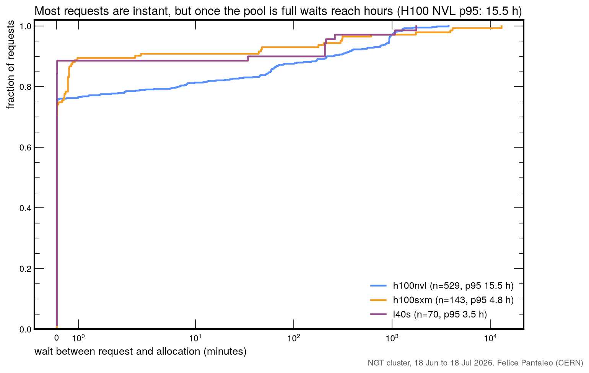

Most requests are instant; the tail waits up to 15.5 h (H100 NVL p95).

---

# A queue exists in all but name

Up to 32 requests wait as Pending pods, racing for freed GPUs.

---

# Who pays: 131 lockouts in a month

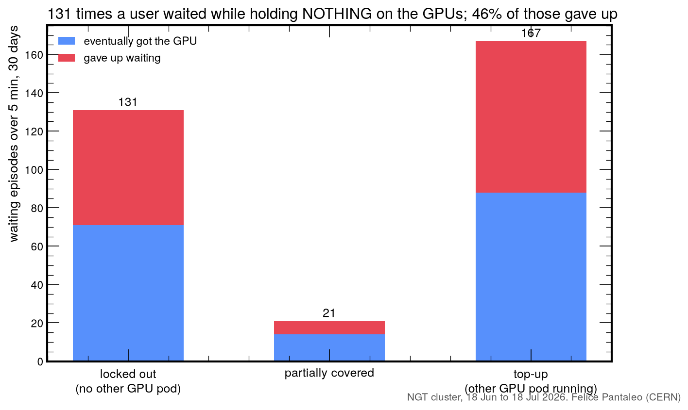

Over half of all queue pressure is top-up demand from users already running.

---

# The cause: 71% of held GPU-hours are idle

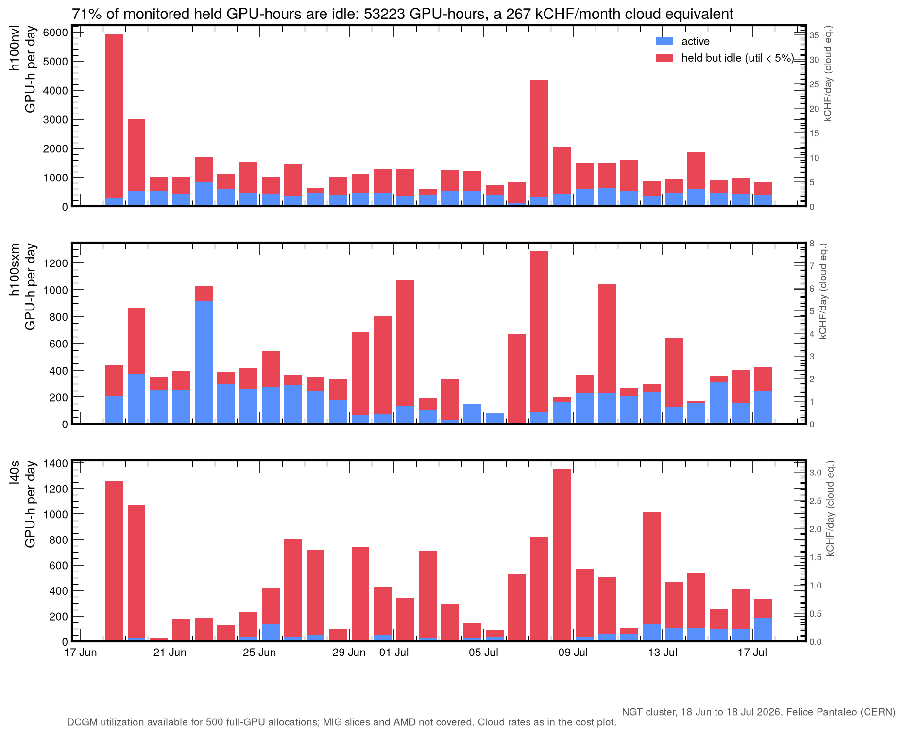

- 53 000 GPU-hours parked in 30 days
- 267 kCHF/month cloud equivalent
- Right axes: kCHF/day per pool
- Continuous idle baseline on NVL and L40S; bursty parked episodes on SXM

---

# Every pool wastes most of its held hours

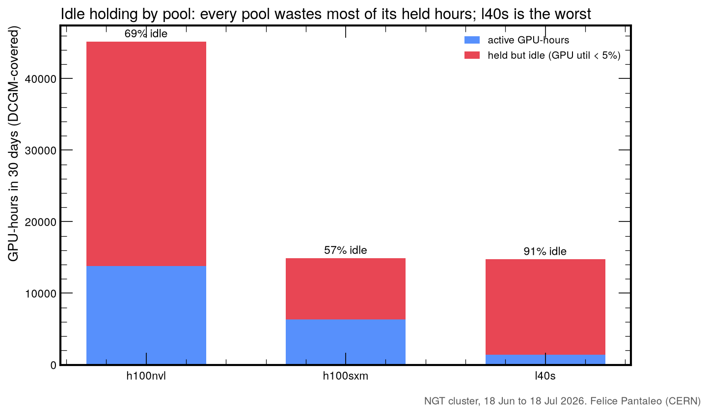

L40S, the designated overflow pool, is 91% idle: a parking lot.

---

# Idleness, not usage, ranks the heavy holders

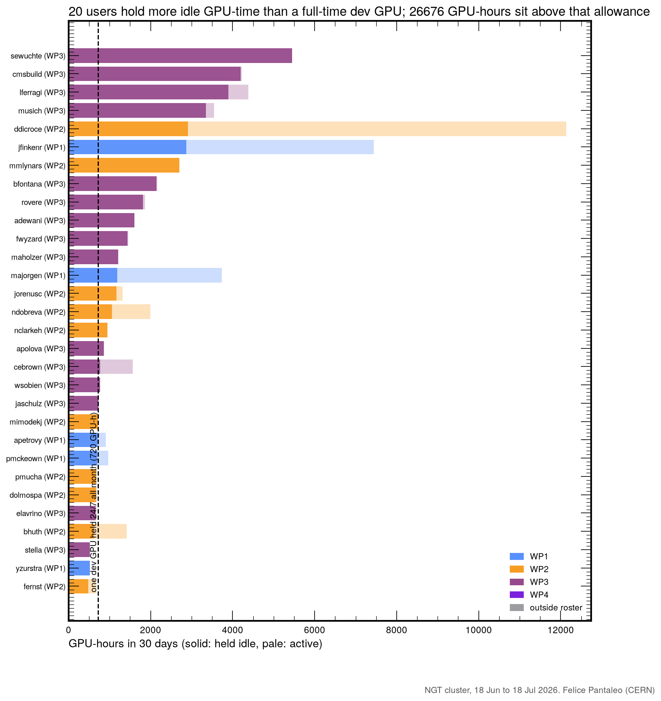

- Solid = held idle, pale = active
- Dashed line: one dev GPU held 24/7 all month (720 GPU-h), the legitimate
  P1 allowance
- **20 users** exceed it
- **26 700 GPU-hours** sit above it
- Greedy and productive are different people: the top consumer is almost
  all active

---

# Where the greediness lives, per pool

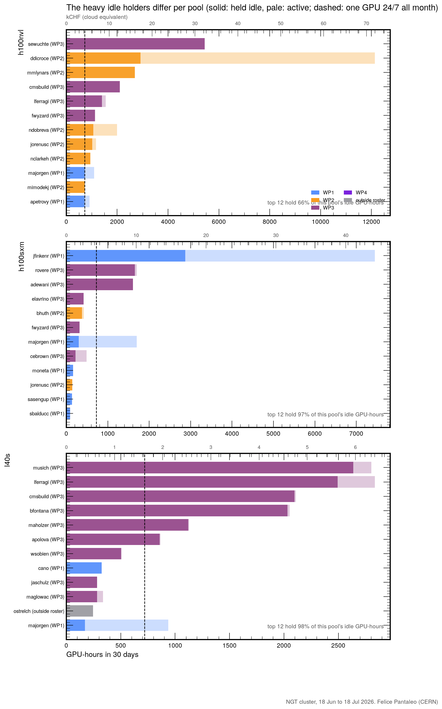

- NVL: broad behavior, top 12 hold 66% of idle
- SXM: three users own the idle hours
- L40S: 12 users own 98% of the idle hours
- Automated reclaim fits NVL; L40S and SXM could be recovered with a
  handful of emails

---

# What this would cost on a public cloud

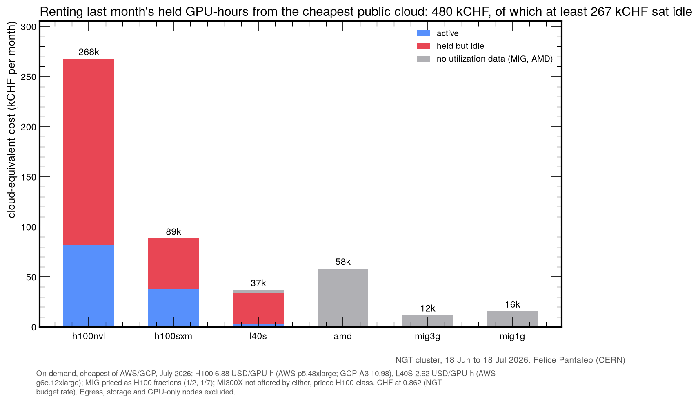

480 kCHF/month rental equivalent, at least 267 kCHF of it idle:
a **3.2 MCHF/year** burn rate on parked silicon.

---

# Who gets the GPU-hours today

WP2 is on its 30% target organically; WP3 runs at 47% (CMS production
and CI included); WP1 at 22%; WP4 consumes nothing yet.

---

# What a policy changes: the real month, replayed

Same 30 days, same requests, replayed through candidate schedulers:

| | today (FCFS) | principles + idle reclaim |
|---|---|---|
| wait p95 | 557 min | **4 min** |
| requests satisfied | 1393 / 1441 | **1430 / 1441** |
| dev sessions within 15 min | 89% | **96%** |
| multi-GPU holds over 24 h | 96 | **0** |

> Reclaim allocations idle longer than 30 min; guarantee one interactive
> GPU per member; cap multi-GPU holds at 24 h; enforce WP shares on live
> demand.

---

# Proposal to the PMC

### Reclaim idle holds

Reap GPU allocations idle for more than 30 min. Attacks 71% of the waste
without touching active work.

### Guarantee the dev GPU

One interactive GPU per member, always. Delivered in minutes in the
replay; MIG carve spread over two nodes.

### Cap and account

24 h cap on multi-GPU holds, GPU time charged to working packages with
model correction factors.

All parameters simulated and tunable; policy simulator, data extraction
and this evidence base are reproducible end to end.

---

<!-- _class: lead -->

# Backup

---

# Backup: unsatisfied requests

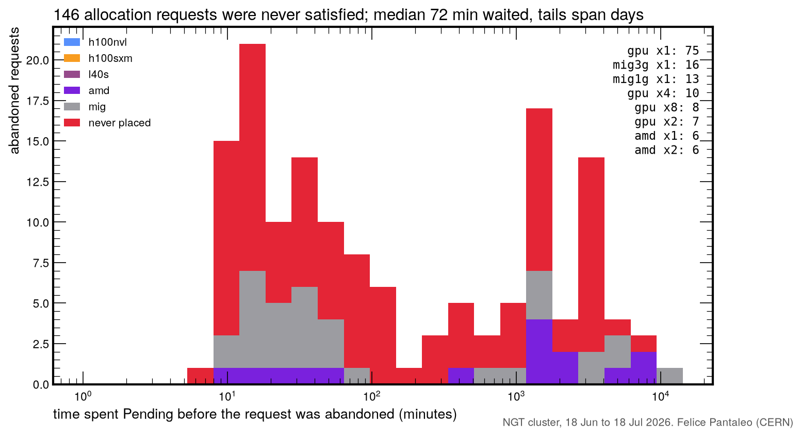

---

# Backup: hold durations vs the 24 h cap

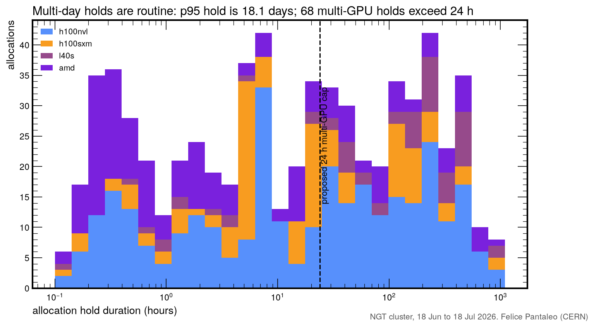

---

# Backup: top consumers per pool, in kCHF

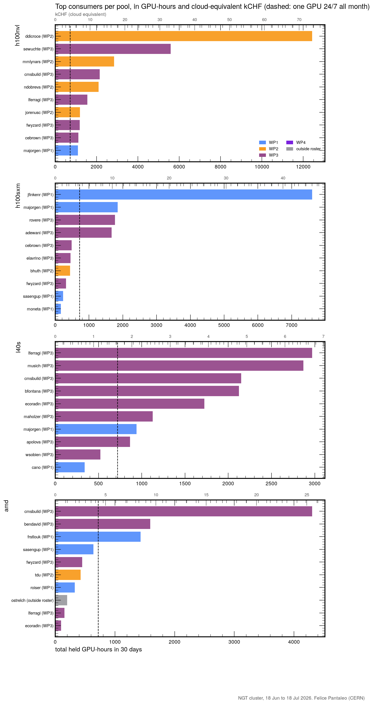

- Secondary axis: cloud-equivalent kCHF, cheapest of AWS/GCP, July 2026
- Dashed: one GPU 24/7 all month
- 31 users held more than one GPU-month

---

# Backup: pool usage by WP, cordons, idle fractions

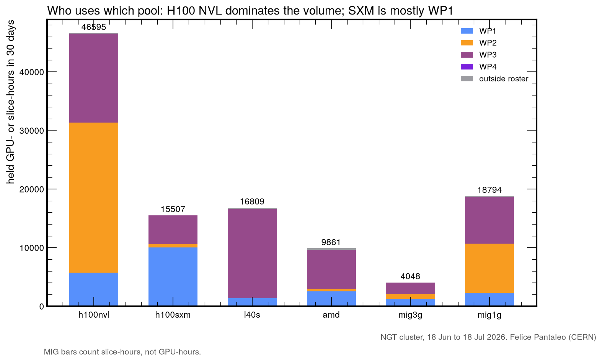

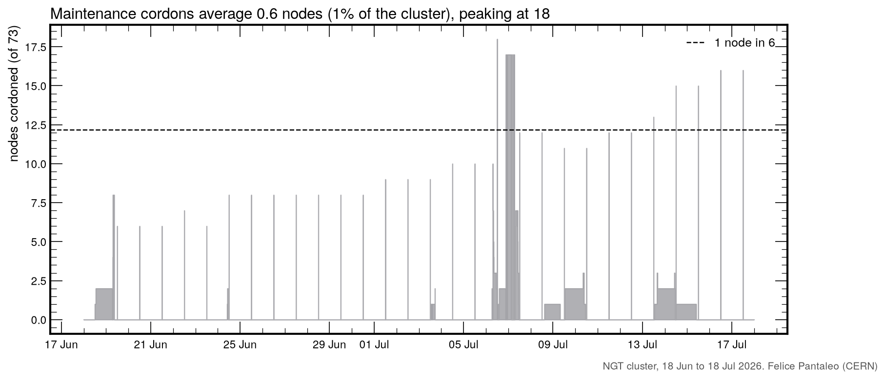

