<!-- _class: lead -->

# The NGT GPU allocation problem, measured

## 30 days of cluster telemetry, and what a policy would change

Felice Pantaleo (CERN)
July 2026

<!--
Speaker notes:
Everything in this deck is measured from cluster monitoring, 18 Jun to 18 Jul 2026.
Nothing on the problem slides is simulated.
-->

---

# Method

### Data

Pod lifecycle, requests, placement, cordons and per-GPU utilization from
cluster monitoring, 30 days at 5 min resolution.

### Scope

1571 GPU/MIG requests from 114 users on the on-premise pools.
STEAM Academy accounts and cloud T4 nodes excluded.

### Attribution

Users mapped to WP1 to WP4 via the project roster, department rules and
manual classification: 99.4% of GPU-hours attributed.

> A request = one pod asking for GPUs. Wait = creation to scheduling.
> Idle = GPU utilization below 5%.

---

# Static allocation

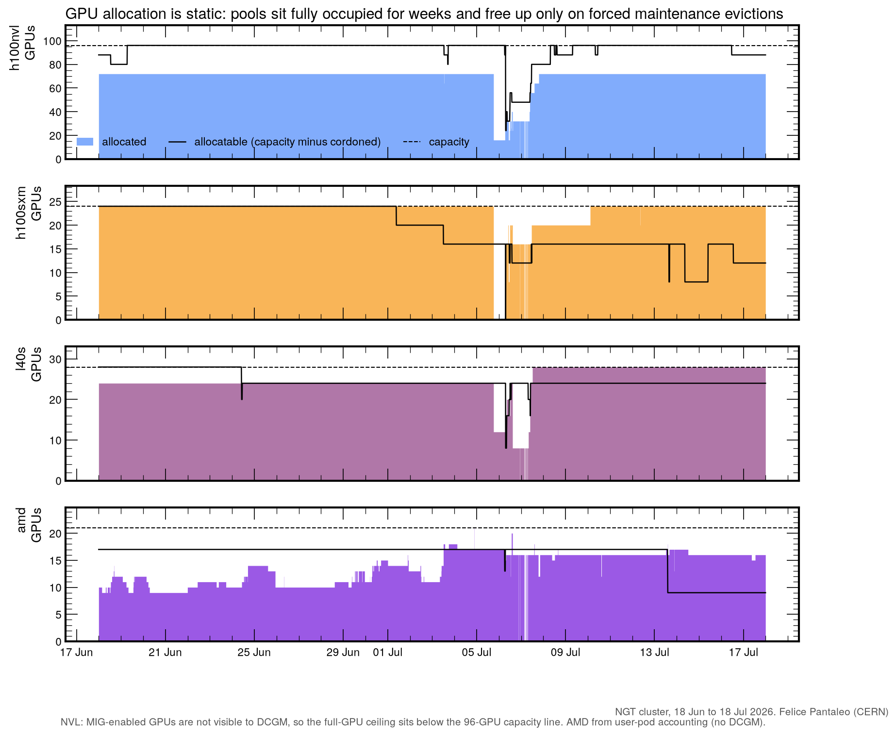

- All pools at their effective ceiling around the clock
- No diurnal variation: allocation follows ownership, not workload
- Only the forced maintenance evictions of 6 to 8 July freed capacity

---

# Waiting times

75 to 90% of requests are satisfied immediately; the H100 NVL p95 wait is 15.5 h.

---

# The Pending queue

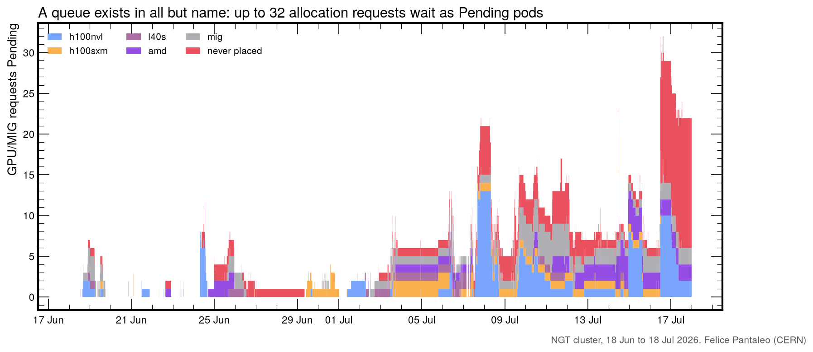

Peak backlog: 32 simultaneous Pending requests, stacked by target pool.

---

# Lockouts

Over half of all queue pressure is top-up demand from users already running.

---

# Idle held GPU-hours

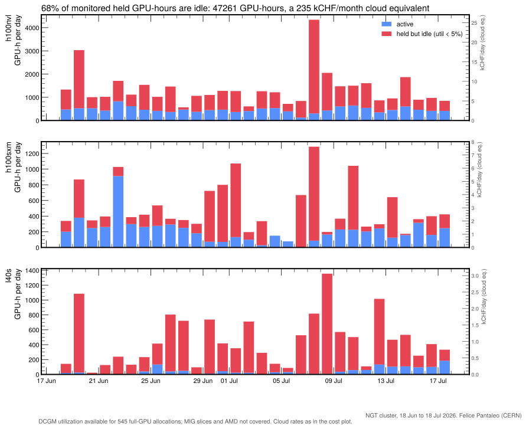

- 53 000 GPU-hours parked in 30 days
- 267 kCHF/month cloud equivalent
- Right axes: kCHF/day per pool
- Continuous idle baseline on NVL and L40S; bursty parked episodes on SXM

---

# Idle share by pool

The L40S pool is idle for 91% of its DCGM-covered held hours.

---

# Heavy idle holders

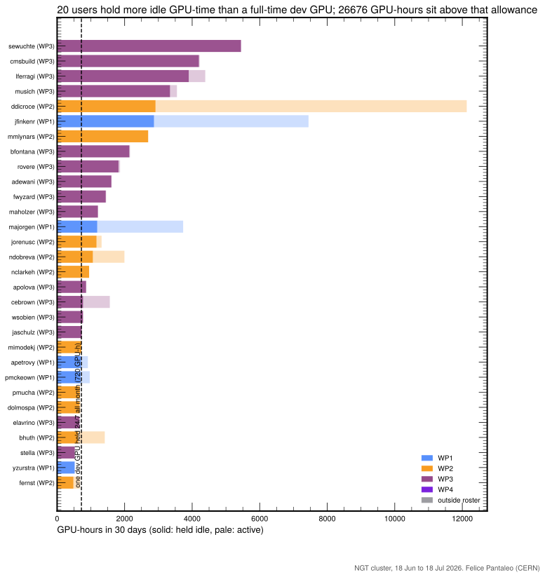

- Solid = held idle, pale = active
- Dashed line: one dev GPU held 24/7 all month (720 GPU-h), the legitimate
  P1 allowance
- **20 users** exceed it
- **26 700 GPU-hours** sit above it
- The consumption and idleness rankings select different users: the top
  consumer is almost entirely active

---

# Idle holders by pool

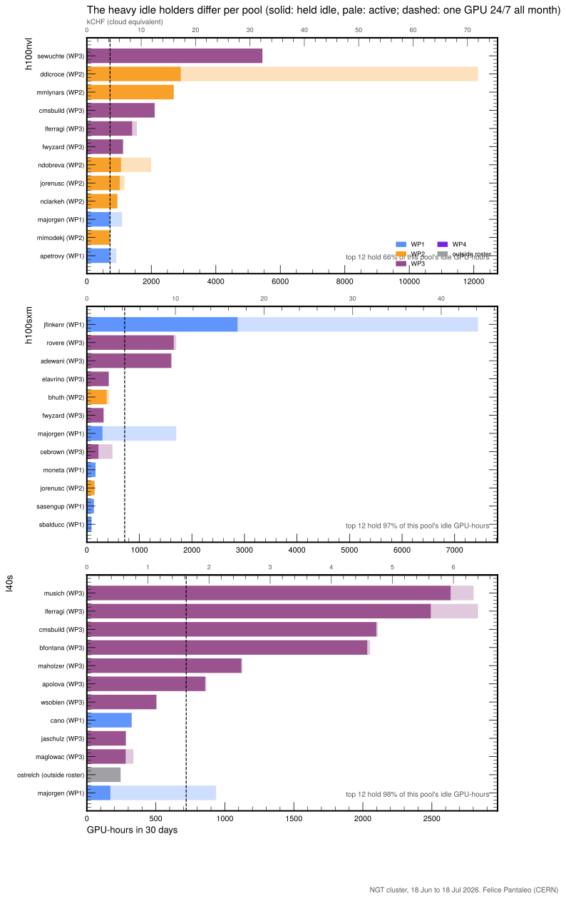

- NVL: broad behavior, top 12 hold 66% of idle
- SXM: three users own the idle hours
- L40S: 12 users own 98% of the idle hours
- The one-session rule and batch-only multi-GPU bound all of this by
  construction

---

# Cloud-equivalent cost

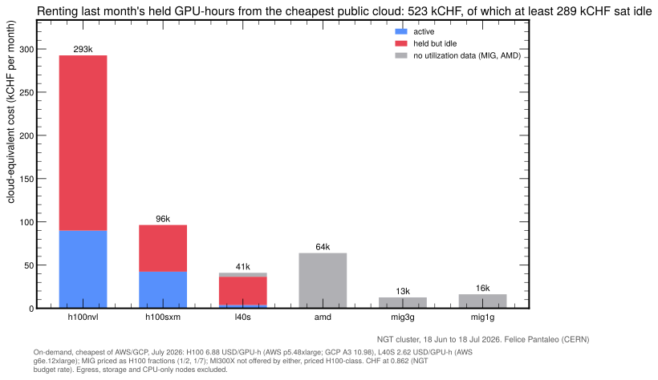

Rental equivalent: 480 kCHF/month, of which at least 267 kCHF idle
(3.2 MCHF/year). On-demand rates, July 2026; egress and storage excluded.

---

# GPU-hours by WP

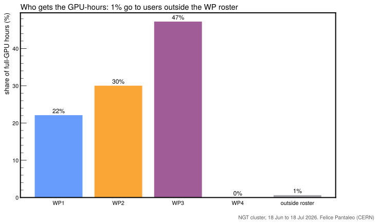

WP2 is on its 30% target organically; WP3 runs at 47% (CMS production
and CI included); WP1 at 22%; WP4 consumes nothing yet.

---

# The real month, replayed

Same 30 days, same requests, replayed through the proposed policy:

| | today (FCFS) | proposed |
|---|---|---|
| wait p95 | 557 min | **0 min** |
| requests satisfied | 96.7% | **99.4%** |
| dev sessions within 15 min | 91% | **98%** |
| NVL idle-held GPU-hours | 35 800 | **13 600** |
| running work terminated by the system | none | **none** |

> Policy: one interactive session per member (a new session supersedes
> the previous one); multi-GPU beyond a 96 GPU-h/month interactive
> allowance runs as batch behind a WP fair-share priority queue.
> Fixed-behavior replay, identical requests for every policy; the FCFS
> baseline reproduces observed waits (median exact, p95 within factor 2).

---

# Proposal to the PMC

### One interactive session

One single-GPU session per member, guaranteed and always available;
opening a new one replaces the old.

### Multi-GPU is batch

Submitted, executed, exits at completion, behind a priority queue with
WP fair share. A 96 GPU-h/month interactive allowance covers debugging.

### Account and adjust

GPU time charged to WPs with model factors. All parameters simulated
and tunable on the real trace.

> Implementable with Kueue plus one admission webhook and a small
> accounting controller. The scheduler terminates no running work.

---

<!-- _class: lead -->

# Backup

---

# Backup: unsatisfied requests

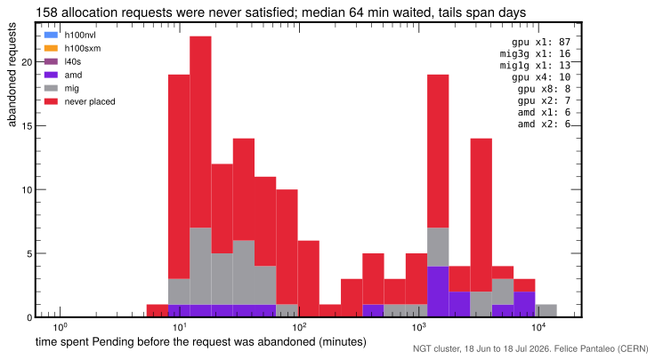

---

# Backup: hold durations

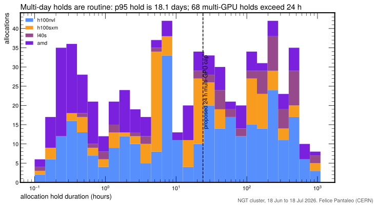

---

# Backup: top consumers per pool

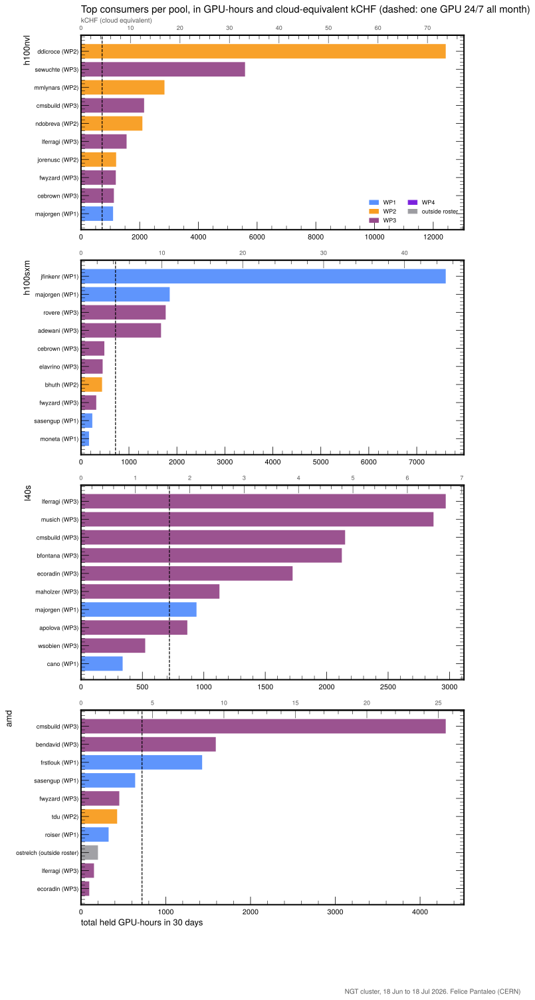

- Secondary axis: cloud-equivalent kCHF, cheapest of AWS/GCP, July 2026
- Dashed: one GPU 24/7 all month
- 31 users held more than one GPU-month

---

# Backup: pools and cordons

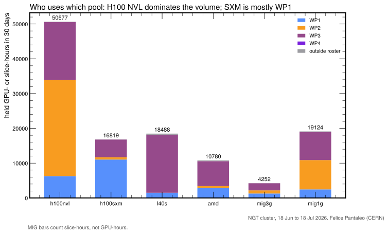

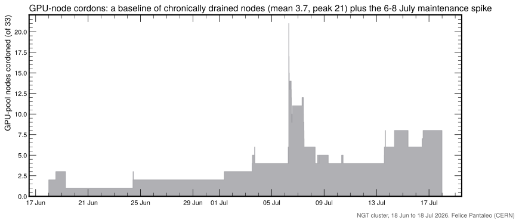

